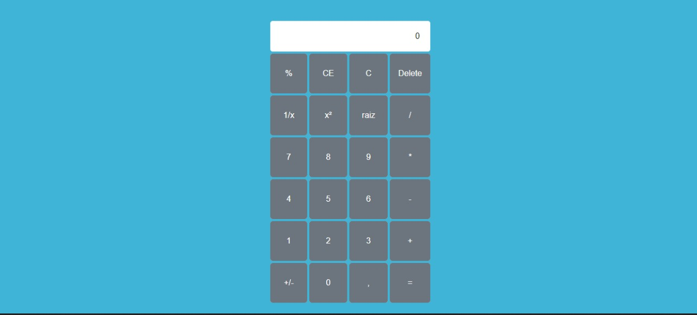

<h1 align="center">
    <h1>Calculadora</h1>
</h1>

  <a href="#-tecnologias">Tecnologias</a>&nbsp;&nbsp;&nbsp;|&nbsp;&nbsp;&nbsp;
  <a href="#-instalação">Instalação</a>&nbsp;&nbsp;&nbsp;|&nbsp;&nbsp;&nbsp;
  <a href="#memo-licença">Licença</a>

  

 

  

## 🚀 Tecnologias

Esse projeto foi desenvolvido com as seguintes tecnologias:

- [HTML](https://www.w3schools.com/html/default.asp)
- [CSS](https://www.w3schools.com/css/default.asp)
- [JavaScript](https://developer.mozilla.org/en-US/docs/Web/JavaScript)

## Instalação

Para instalar esse projeto você deve ter yarn ou npm e executar os seguintes comandos:

...
yarn install
...

...
yarn dev
...

ou

...
npm install
...

...
npm dev
...

## :memo: Licença

Esse projeto está sob a licença MIT. Veja o arquivo [LICENSE](LICENSE.md) para mais detalhes.

Este projeto foi desenvolvido com ❤️ por **[@John Everton](https://www.linkedin.com/in/john-everton01/)**.  
Se isso te ajudou, dê uma ⭐, isso vai me ajudar também! 😉

